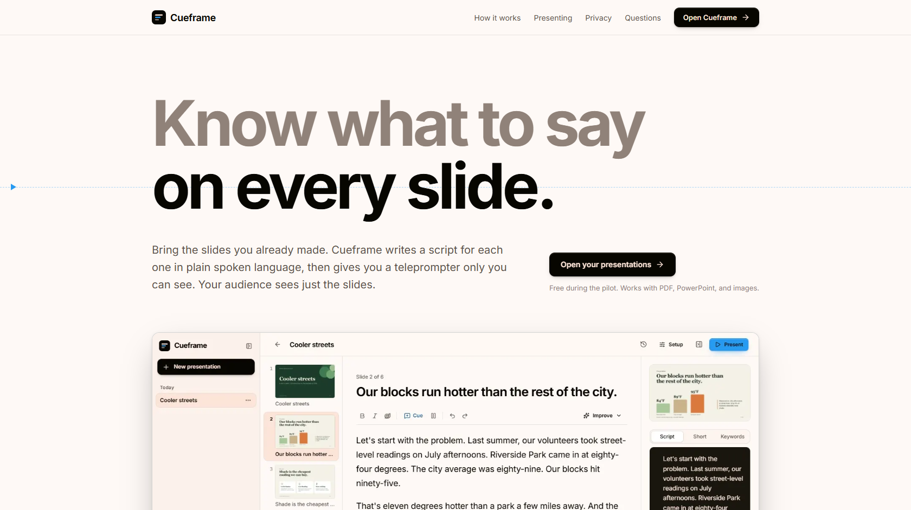
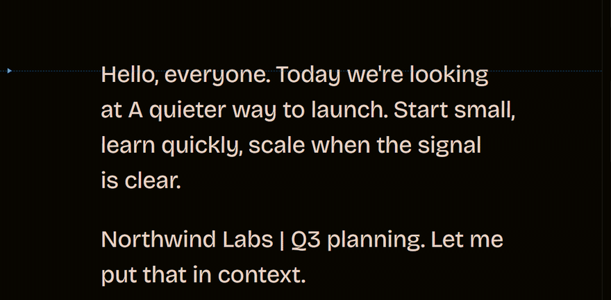
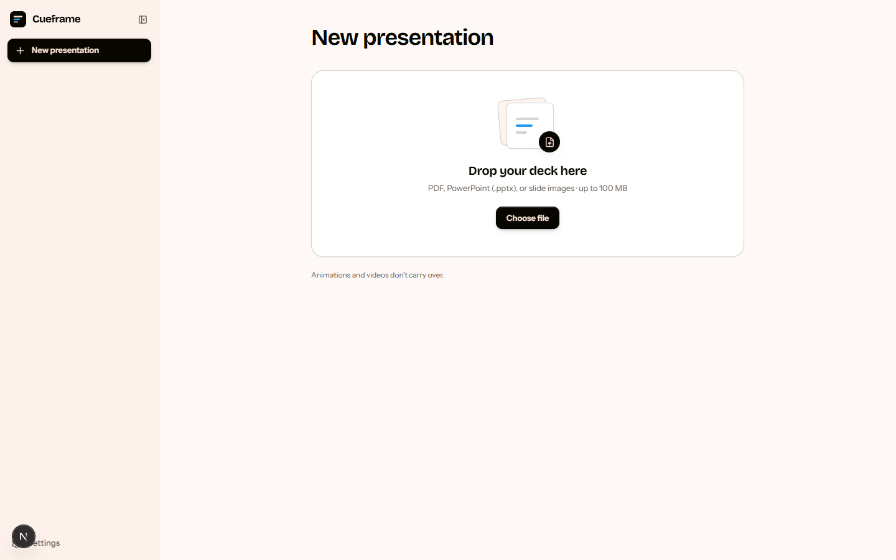
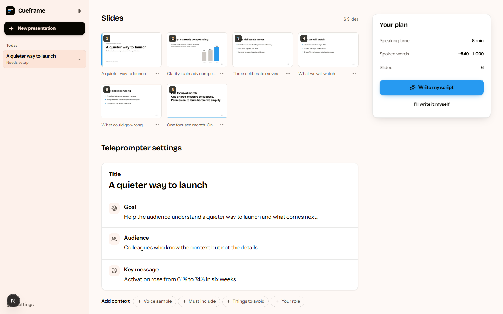
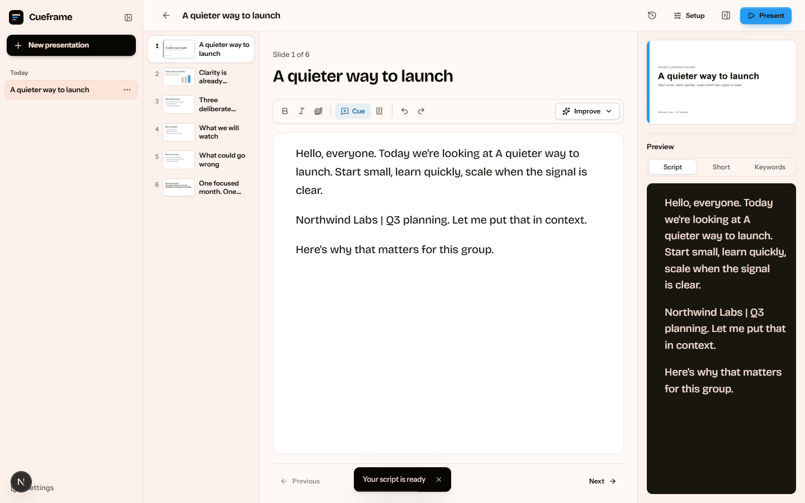
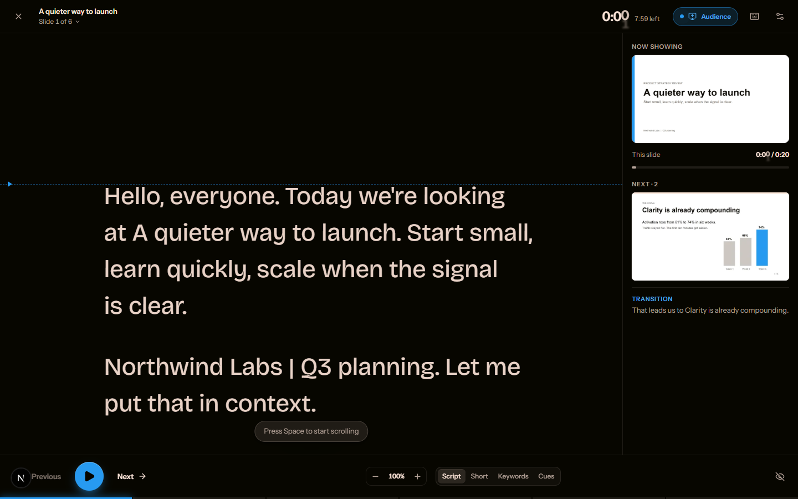
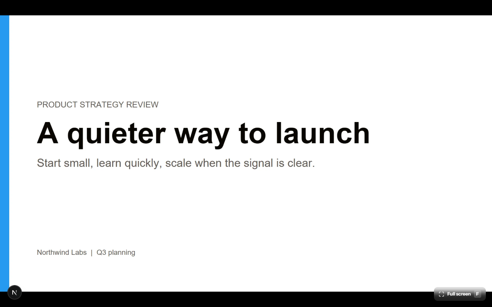

<p align="center">
  
</p>

<p align="center">
  <a href="https://github.com/girwandhakal/PresentationPrompter/actions/workflows/ci.yml"></a>
  
  
  
</p>

<p align="center"><b>Bring the deck you already made. Get a script that sounds like you. Present with notes only you can see.</b></p>

Cueframe turns an existing slide deck into a private, slide-aware script and teleprompter. It's built
for prepared, introverted presenters who want to sound natural, stay oriented, and recover calmly if
they lose their place — not to score their delivery. You control the pace and the wording; there's
nothing to game.

## See it in motion

<p align="center">
  
</p>

<p align="center"><i>Your private script and pacing. The room only ever sees your slides.</i></p>

## The loop

**import → optional AI suggestions → setup → generate → edit → present → timing review**

<table>
<tr>
<td width="50%" valign="top">
  
  <br /><b>1 · Import</b><br />
  Drop in a PDF, PowerPoint (.pptx), or ordered slide images. PDF gives the most exact visuals;
  Keynote and Google Slides export to PDF first.
</td>
<td width="50%" valign="top">
  
  <br /><b>2 · Tell it about your talk</b><br />
  Background analysis suggests a goal, audience, and key message you can accept or rewrite. Set your
  speaking rate, time budget, and reading style.
</td>
</tr>
<tr>
<td width="50%" valign="top">
  
  <br /><b>3 · Edit like a script, not a slide</b><br />
  A real rich-text editor (Lexical) with cues, undo/redo, and reversible AI rewrites — shorten,
  simplify, add an example — next to a live Script / Short / Keywords preview.
</td>
<td width="50%" valign="top">
  
  <br /><b>4 · Present with private notes</b><br />
  Pace-matched scrolling with a reading line at eye level, a cancelable auto-advance countdown,
  per-slide timers, and a blank-screen recovery key.
</td>
</tr>
</table>

<p align="center">
  
  <br /><i>5 · The audience window — slide images only. Script, cues, and notes never cross the sync channel.</i>
</p>

Then **review** shows how your actual pace compared to the plan, slide by slide.

## Quick start

```bash
npm install
cp .env.example .env.local   # then add your OpenAI key (optional — see below)
npm run dev                  # http://localhost:3000
```

No key yet? Run `npm run dev:demo` to use the built-in **demo AI**. It builds scripts from your slide
text, so you can try every screen without a key, network access, or spending anything. The app labels
this mode everywhere it applies.

Sign-in and cross-device sync are entirely optional — leave the Firebase variables in `.env.local`
empty and Cueframe runs as a local-only workspace, with everything kept in your browser's IndexedDB.

Requires Node.js 22.13 or newer.

Contributor and agent guidance lives in [`CLAUDE.md`](CLAUDE.md); it distinguishes the
working app from the planned hosted pilot. Earlier planning documents are in git history.
The original [product overview](Docs/PRODUCT_OVERVIEW.md) lives in the root `Docs/`
folder and is the source of truth for product requirements.

## Configuration

**AI**

| Variable | Required | Purpose |
| --- | --- | --- |
| `OPENAI_API_KEY` | For AI writing | Server-side key for the OpenAI Responses API. Never sent to the browser. |
| `OPENAI_MODEL` | No | Model for every AI stage (default `gpt-5.4-mini-2026-03-17`). Must support structured outputs and image input. Use a dated snapshot so usage counts toward OpenAI's complimentary data-sharing tokens. |
| `OPENAI_WRITER_MODEL` | No | A different model for script writing and rewrites only (for example `gpt-5.4-2026-03-05`). Defaults to `OPENAI_MODEL`. A full-size model costs more and draws from the smaller complimentary pool. |
| `OPENAI_BASE_URL` | No | Point at an OpenAI-compatible proxy or gateway. |
| `AI_PROVIDER` | No | `demo` forces the keyless demo provider (development and tests). |
| `AI_ALLOW_UNMETERED` | No | `1` lets a production build use `OPENAI_API_KEY` without sign-in and quotas. Only for a private preview; never on a public deployment. |

With no key and no `AI_PROVIDER`, a production build shows a calm "AI isn't set up" state. People
can still import, write scripts by hand, and present. A production build also keeps AI off until
sign-in (the Firebase variables) and quotas (`FIREBASE_SERVICE_ACCOUNT`) are both configured, so a
missing setting can never leave the key open to unmetered use.

**Sign-in and cloud sync — optional**

| Variable | Required | Purpose |
| --- | --- | --- |
| `NEXT_PUBLIC_FIREBASE_*` | For sign-in | Public Firebase web app config (six variables — see `.env.example`). Leave them all empty to run local-only, no account needed. |
| `NEXT_PUBLIC_AUTH_MODE` | No | Set to `off` to skip sign-in even when Firebase is configured (this is how the e2e suite runs). |
| `NEXT_PUBLIC_RECAPTCHA_SITE_KEY` / `NEXT_PUBLIC_APPCHECK_DEBUG_TOKEN` | No | Firebase App Check, once enforcement is turned on. |
| `FIREBASE_SERVICE_ACCOUNT` | For AI in production | Server-side only. Turns on the daily AI allowances and rejects revoked sessions and disabled users. A production build with `OPENAI_API_KEY` keeps AI off without it. Never commit it. |
| `QUOTA_EXEMPT_EMAILS` | No | Server-side only. Comma-separated verified sign-in emails exempt from the daily AI allowances (usage is still recorded). Takes effect only with `FIREBASE_SERVICE_ACCOUNT` set. |
| `NEXT_PUBLIC_SITE_URL` | No | Public origin for social-card links. |

When Firebase is configured, Google sign-in gates the workspace and every local write mirrors to that
account's Firestore and Storage — so a project survives a cleared browser and follows you to another
device. [`firestore.rules`](firestore.rules) and [`storage.rules`](storage.rules) scope every document
and file to its owner, and a blocking Cloud Function ([`functions/`](functions/)) caps how many
accounts can sign up. See [`.env.example`](.env.example) for the full list with comments.

## How it works

```text
Browser (everything the user creates lives here)
 ├─ Import: pdf.js renders PDFs; PPTX is parsed from OOXML; images are normalized
 ├─ IndexedDB: projects, slide images (Blobs), script versions, presenter sessions — the working copy
 ├─ Orchestrator: analyze → deck context → plan (local) → outline → write, in bounded batches
 ├─ Editor (Lexical), Presenter, Review
 ├─ Audience window ◀── BroadcastChannel (slide index, blank, ended — never script text)
 │
 ├─ optional: Google sign-in ──▶ Firestore + Storage (per-account mirror, owner-only rules)
 │
 ▼  /api/ai/*  (Next.js route handlers)
AI gateway: verify sign-in → schema-validated request → OpenAI structured outputs → validation
```

- **Local-first.** Decks, scripts and history are stored in the browser's IndexedDB, and all storage
  goes through [`lib/store/db.ts`](lib/store/db.ts) so sync can layer on top without changing how the
  app reads or writes locally. Settings has delete-everything.
- **Optional cloud sync.** [`lib/store/cloud.ts`](lib/store/cloud.ts) mirrors local writes to the
  signed-in account's Firestore and Storage. Newest `updatedAt` wins, unconfirmed writes retry from an
  IndexedDB outbox, and a device only re-fetches documents newer than its own last-synced cursor.
- **AI pipeline.** [`lib/ai/orchestrator.tsx`](lib/ai/orchestrator.tsx):
  - Analysis starts as soon as slides are imported. It reads each slide's image and text and
    prefills the setup form with suggestions.
  - Generation plans a word budget per slide ([`lib/domain/planner.ts`](lib/domain/planner.ts)),
    outlines the narrative arc, then writes four slides per model call, three calls at a time.
  - A versioned runtime guide supplies relevant speech examples; full scripts, notes and keyword
    cues have separate instructions. The first slide opens with a greeting ("Hello, everyone.") and
    the last closes with thanks ("Thank you, everyone."); code adds either line if the model omits it.
  - The writing guide paraphrases routine change/feature lists into grouped spoken summaries,
    with relevant highlights. Ordered instructions and important comparisons retain their detail.
    Thin slides stay brief rather than being padded.
  - Local checks (figures not found in the slide, unreadable slides, very short drafts) become
    private notes. They never block saving and never call a model.
  - Generated scripts are plain prose: no cues, bold or slow marks. Presenters add their own
    private cues and formatting in the editor. Model and prompt versions, latency and token usage
    are kept with the draft in local storage.
  - A draft is saved only when every slide came back valid, and earlier versions are kept in History.
- **Rewrites.** Actions work on a slide or on selected text (shorten, simplify, clearer transition,
  add example, and so on). They always show a proposal to accept or discard, and never overwrite
  silently.
- **Presenter.**
  - Scrolling speed comes from your words per minute, with a reading line at eye level.
  - Auto-advance uses a countdown you can cancel. Reading modes are full script, short, keywords
    and cues only.
  - Per-slide timers, blanking the audience screen, and a keep-awake lock.
  - Clicker keys work in both windows. A paper backup — the full script with slide thumbnails — prints
    from `/p/[id]/print`.
- **Privacy.** The audience window loads only slide images. Scripts and cues never cross the sync
  channel, and an end-to-end test checks this. AI requests contain slide images, slide text and the
  brief, only when the user asks for a script or rewrite. The server doesn't log content.

## Scripts

| Command | What it does |
| --- | --- |
| `npm run dev` / `npm run dev:demo` | Development server (real AI / demo AI) |
| `npm run build` | Production build (`next build`) |
| `npm run preview` | Serve the production build locally (`next start`), including security headers |
| `npm run lint` · `npm run typecheck` | ESLint · TypeScript |
| `npm test` | Unit and API integration tests (demo provider, no network) |
| `npm run test:rules` | Firestore/Storage Security Rules against local emulators (needs JDK 21+) |
| `npm run eval` | Paid evaluation, disabled by default. Requires explicit `--live=true --deck=<name> --budget=<token-cap>` after agreeing on spending. Saves scripts and diagnostic scores in `outputs/`. |
| `npm run test:e2e` | Playwright end-to-end tests against a production build. They use your installed Chrome; set `PLAYWRIGHT_CHANNEL=msedge` or `""` for bundled Chromium |
| `npm run check` | Lint, typecheck, unit tests, and build |
| `npm run sample-deck` | Regenerate `public/sample-deck.pdf` (the first-run sample, also a test fixture) |

A generation makes one analysis call per four slides, one context call, one outline call,
and one write call per four slides, all on `OPENAI_MODEL` unless
`OPENAI_WRITER_MODEL` is set. There are no automatic review, repair or retry-for-quality passes.
API token caps are not dollar limits. The historical study in
[research/](research/script-quality.md) measured an earlier, heavier pipeline.

[Continuous integration](.github/workflows/ci.yml) runs lint, typecheck, unit tests, a production
build, the Security Rules suite, and the Playwright journeys on every push and pull request — entirely
offline, with the demo provider and sign-in switched off, so forks and PRs never touch API credits.

## Deployment

The app is a standard Next.js build, intended for Vercel. A small, invite-gated hosted pilot on
Firebase Authentication, Firestore, and Storage is the planned rollout — see [`CLAUDE.md`](CLAUDE.md)
for what's implemented today versus still planned.

1. Set `OPENAI_API_KEY` (and optionally `OPENAI_MODEL`) as sensitive environment variables. AI also
   needs the `NEXT_PUBLIC_FIREBASE_*` variables (sign-in) and `FIREBASE_SERVICE_ACCOUNT` (quotas);
   without them a production build keeps AI off.
2. If sign-in is enabled, deploy `firestore.rules`, `storage.rules`, and the signup-gating function in
   [`functions/`](functions/) with the Firebase CLI.
3. Run `npm run check`, then deploy; Vercel runs `next build` itself.

`next.config.ts` adds security headers to every response and a strict Content Security Policy to
production builds. Cloud sync is entirely optional — without it the app needs no database, bucket, or
queue at all.

Sign-in, cloud copies, and quotas use Firebase (`NEXT_PUBLIC_FIREBASE_*`, see `.env.example`):

- Deploy `firestore.rules` and `storage.rules` with the Firebase CLI before a client that depends
  on them.
- Slide images are uploaded to Cloud Storage and downloaded on other devices. Browsers can only
  download them after the bucket allows cross-origin reads, once per bucket (Cloud Shell has gcloud):
  `gcloud storage buckets update gs://<project>.firebasestorage.app --cors-file=storage.cors.json`.
  Without it, presentations opened on another browser show title cards instead of slide images.
  Access is still limited to each file's owner by `storage.rules`.

## Supported files and limits

- **PDF** gives exact visuals and is the recommended format. Keynote and Google Slides should be
  exported to PDF first.
- **PowerPoint (.pptx)** is read in the browser: order, text, speaker notes, and the largest picture
  per slide. Slides appear as simplified previews. Charts, SmartArt, animations and video are
  flagged, and the fix is to export a PDF and use **Replace slides** (scripts carry over by content).
- **Images** (PNG, JPEG, WebP): multiple files are ordered by name and can be reordered in setup.
- Up to 100 MB per file and 120 slides per presentation. Legacy `.ppt` is not supported.

## Keyboard shortcuts (Presenter)

`Space` scroll · `→`/`PageDown` next · `←`/`PageUp` previous · `↑`/`↓` nudge · `Home`/`End` start or
end of slide · `B` blank audience · `C` cues · `+`/`−` pace ·
`F` full screen · `Esc` cancel or end · `?` all shortcuts

Editor: `Ctrl/⌘ K` add cue · `Ctrl/⌘ B`/`I` bold/italic · `Alt ↑`/`↓` switch slides · `Ctrl/⌘ S` save now.

## Known limitations

- The presenter and audience windows sync through `BroadcastChannel`, so they must be in the same
  browser profile on the same computer. That is the usual projector or screen-share setup.
- Browsers can't choose which monitor a window opens on or hide a window from screen capture. The
  preflight checklist walks through sharing only the audience window.
- PowerPoint animations and transitions are outside the current scope.

---

<p align="center">
  <a href="Docs/PRODUCT_OVERVIEW.md">Product overview</a> ·
  <a href="CLAUDE.md">Contributor &amp; agent guide</a> ·
  Built with Next.js, Lexical, and Firebase
</p>
